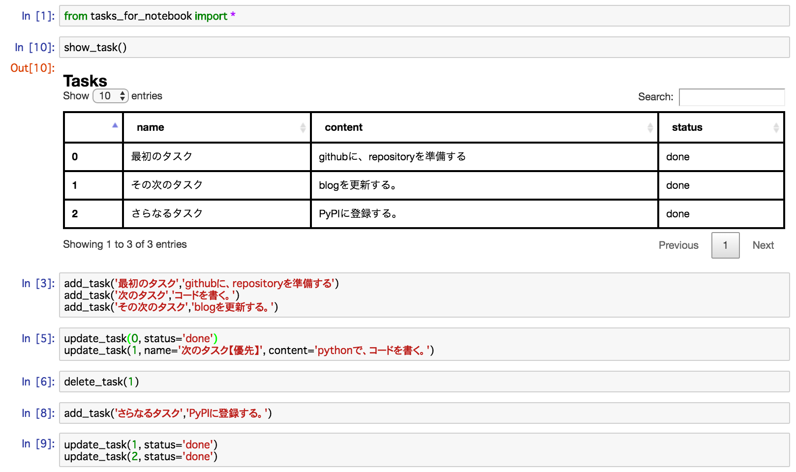

# tasks-for-notebook

This is TODO list on ipython notebook.

<p align="center">

</p>

## Install

```
pip install tasks-for-notebook
```

## Usage

import

```
from tasks_for_notebook import *
```

show tasks

```
show_task()
```

add task

```
add_task('name', 'content')
```

update task

```
update_task(0, status='done')
update_task(2, name='new name', content='new content')
```

delete task

```
delete_task(1)
```
